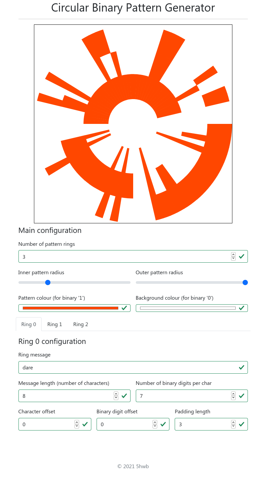

# Circular Binary Pattern Generator

Generate a unique pattern with a hidden message encoded within in binary. All aspects of the pattern are fully customisable - colour, message length, number of binary digits, padding length and more!

This was inspired largely by the hidden message encoded on NASA's Perseverance rover parachute.

## How to run

1. Download this repository to your device.
2. Open `home.html` and start fiddling

## Screenshot

